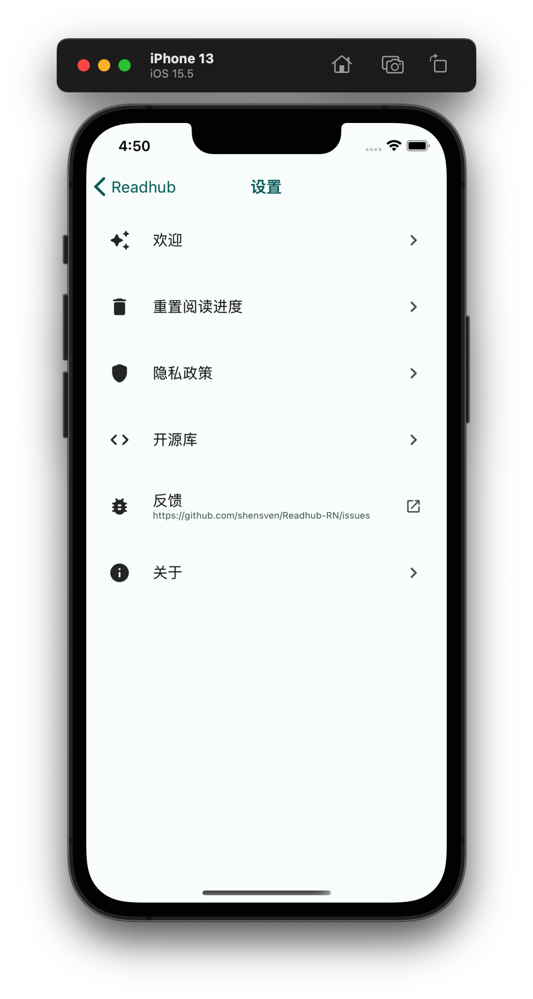

<div align="center" >
  <h1>
    
    <p>Readhub RN</p>
  </h1>
</div>

[](./LICENSE)
[](./package.json)
[](./package.json)
[](https://github.com/shensven/Readhub-RN/actions/workflows/test.yml)
[](https://github.com/shensven/Readhub-RN/actions/workflows/publish.yml)

[](https://www.codacy.com/gh/shensven/Readhub-RN/dashboard?utm_source=github.com&utm_medium=referral&utm_content=shensven/Readhub-RN&utm_campaign=Badge_Grade)

SvenFE implementation of [Readhub](https://readhub.cn) in React Native, Currently in refactoring...

|                            1                             |                            2                             |                            3                             |
| :------------------------------------------------------: | :------------------------------------------------------: | :------------------------------------------------------: |
|  |  |  |

## 📦 DISTRIBUTION

### iOS

- Not released yet

### Android

- Download the apk via [GitHub Release](https://github.com/shensven/Readhub-RN/releases)

## 🔨 BUILD

### INTRO

- Written in [React Native](https://reactnative.dev)
- does NOT collect any of your privacy data
- To keep dependencies up to date under the same major version via [Dependabot](https://github.com/features/security/software-supply-chain)
- Testing and continuous integration via [Github Actions](https://github.com/shensven/Readhub-RN/actions)
- Has [Hermes](https://hermesengine.dev) enabled, so it is recommended to use [Flipper](https://fbflipper.com) for debugging

### PREREQUISITES

- [Node 18](https://nodejs.org) or higher
- The [yarn](https://yarnpkg.com/getting-started/install) package manager
- [Watchman](https://formulae.brew.sh/formula/watchman)
- [Xcode 10](https://developer.apple.com/xcode/resources) or higher
- [CocoaPods](https://guides.cocoapods.org/using/getting-started.html)
- [JDK 11](https://formulae.brew.sh/formula/openjdk@11) or higher
- Android SDK
  - Build-Tools `33.0.0`
  - NDK `23.1.7779620`

### GET STARTED

```sh
yarn install
cd ios && pod install
```

### DEBUGGING ON THE SIMULATOR

```sh
yarn ios
```

```sh
yarn android
```

### DEBUGGING ON THE DEVICE

```sh
npm install -g ios-deploy
```

```sh
yarn ios --device
```

```sh
yarn android run-android
```

### TEST

```sh
yarn test
```

```sh
cd android
chmod +x gradlew
./gradlew test
```

### iPhone DEPLOY

```sh
yarn ios --configuration Release --device
```

### ASSEMBLE THE APK

```sh
cd android
./gradlew assembleRelease
```

### BOOTSPLASH GENERATION

```sh
yarn react-native generate-bootsplash src/assets/splash/bootsplash.png \
  --background-color=DAE5E3 \
  --logo-width=192 \
  --flavor=main
```

## 📜 LICENSE

[](https://app.fossa.com/projects/git%2Bgithub.com%2Fshensven%2FReadhub-RN?ref=badge_large)
