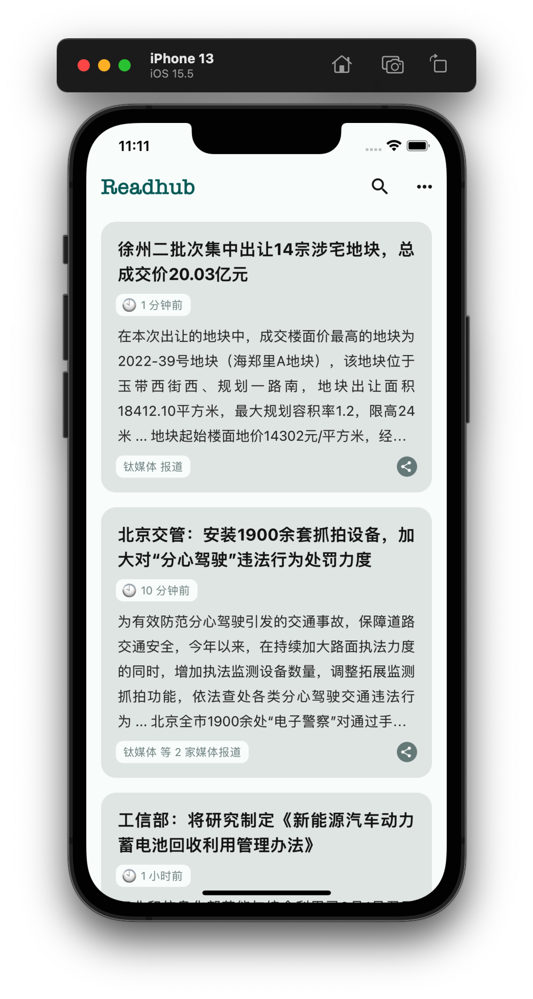
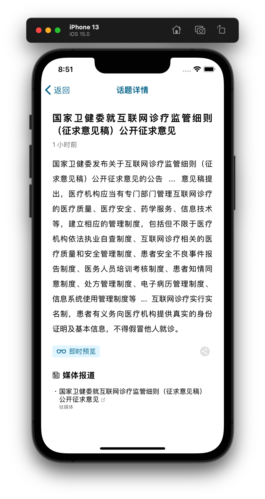
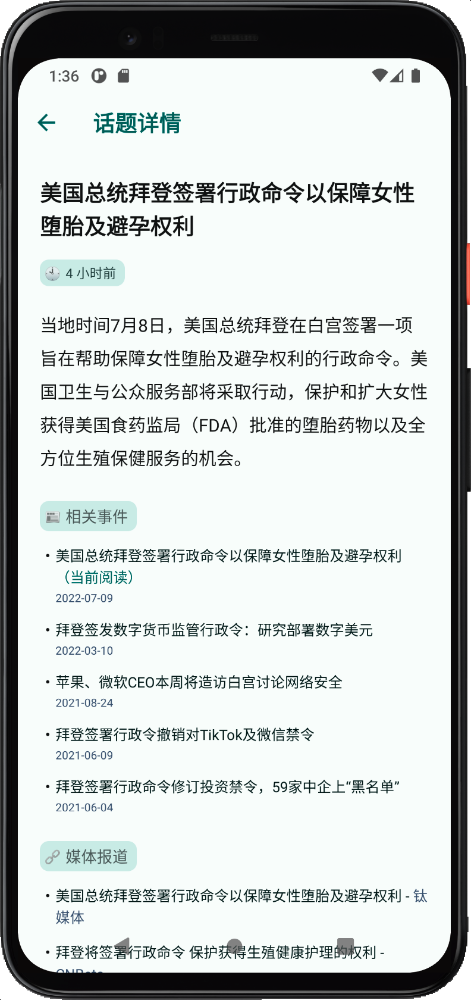

# Readhub Native

[](./LICENSE)
[](./package.json)
[](./package.json)
[](https://github.com/shensven/Readhubn/actions/workflows/next.yml)
[](https://github.com/shensven/Readhubn/actions/workflows/main.yml)
[](https://app.codacy.com/gh/shensven/Readhubn?utm_source=github.com&utm_medium=referral&utm_content=shensven/Readhubn&utm_campaign=Badge_Grade_Settings)
[](https://github.com/shensven/Readhubn/pulls)

English | [简体中文](./README-zh-cn.md)

[readhub.cn](https://readhub.cn) implementation in React Native

|                         iOS Home                         |                     iOS Topic Detail                     |                       Android Home                       |                   Android Topic Detail                   |
| :------------------------------------------------------: | :------------------------------------------------------: | :------------------------------------------------------: | :------------------------------------------------------: |
|  |  |  |  |

## INTRO

- The project is written entirely in [React Native](https://reactnative.dev)
- The build product of the project does NOT collect any of your privacy, and does NOT contain any mix private goods
- The project use [WhiteSource Renovate](https://www.whitesourcesoftware.com/free-developer-tools/renovate) to keep dependencies up to date under the same major version
- The Android part of the project uses [Github Workflow](https://github.com/shensven/Readhubn/actions) exclusively for unit testing and continuous integration
- The project has [Hermes](https://hermesengine.dev) enabled, so it is recommended to use [Flipper](https://fbflipper.com) for debugging
- The project uses [React Native Reanimated](https://docs.swmansion.com/react-native-reanimated), a high-performance animation component written in C++

## INSTALL

<a href='https://play.google.com/store/apps/details?id=com.shensven.readhubn'></a>

## BUILD

### PREREQUISITES

- [Node 12](https://nodejs.org) or higher, [nvm](https://github.com/nvm-sh/nvm) is recommended for installation
- The [yarn](https://yarnpkg.com/getting-started/install) package manager
- [Watchman](https://formulae.brew.sh/formula/watchman)
- [JDK 8](https://formulae.brew.sh/formula/openjdk@8) or higher, [JDK 11](https://formulae.brew.sh/formula/openjdk@11) recommended
- [Android SDK Platform 30](https://developer.android.com/studio/releases/platforms), recommended for installation via [android studio](https://developer.android.com/studio)
- [Xcode 10](https://developer.apple.com/xcode/resources) or higher
- [CocoaPods](https://guides.cocoapods.org/using/getting-started.html)

### GET STARTED

```sh
yarn install
```

```sh
cd ios && pod install
```

### RUNNING ON DEVICE & SIMULATOR

```sh
yarn react-native run-android
```

```sh
yarn react-native run-ios
```

### DEBUGGING

Using [Flipper](https://fbflipper.com/) for debugging

### TEST

```sh
yarn test
```

```sh
cd android && chmod +x gradlew && ./gradlew test
```

### ASSEMBLE THE APK

```sh
cd android && ./gradlew assembleRelease
```

### BOOTSPLASH GENERATION

```sh
yarn react-native generate-bootsplash src/assets/Splash/bootsplash.png \
  --background-color=E8F6FE \
  --logo-width=256 \
  --assets-path=assets \
  --flavor=main
```
